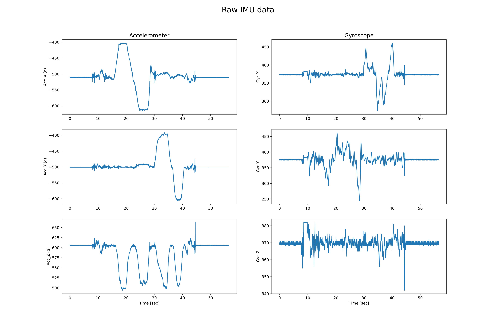
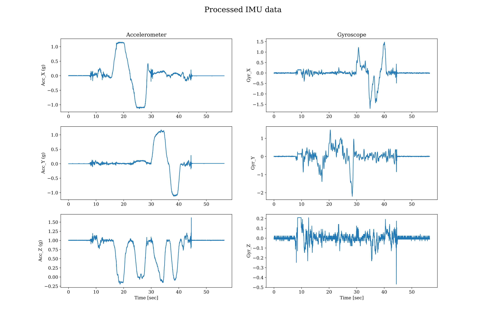
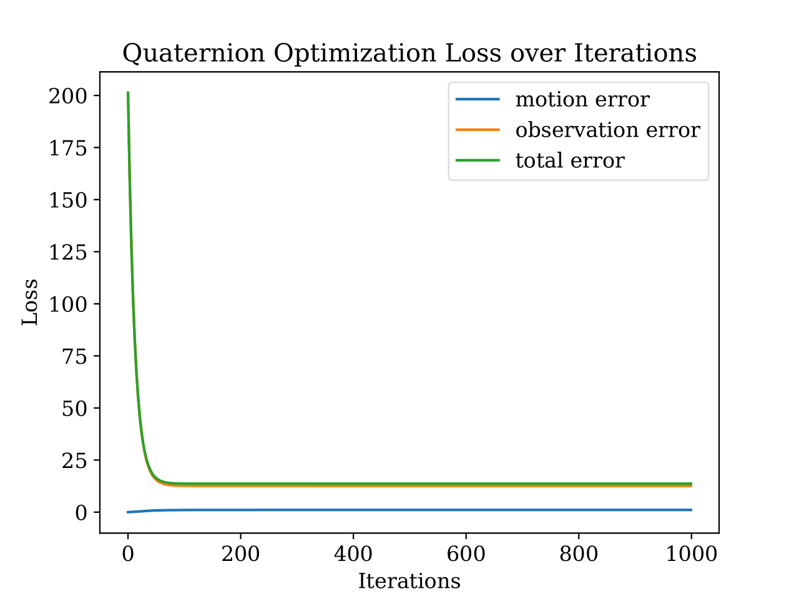
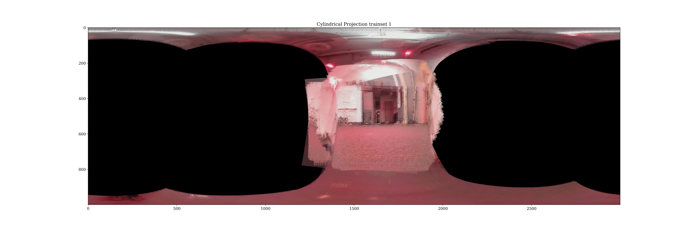
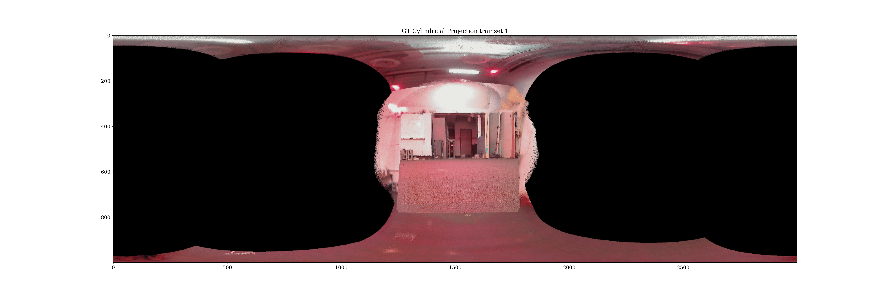

# IMU Orientation Tracking and Panorama Reconstruction

## Overview
This project focuses on estimating the 3D orientation of a rotating body using IMU data and constructing panoramic images from captured camera frames. The orientation estimation is achieved through a projected gradient descent algorithm, ensuring stable quaternion-based tracking. The estimated orientations are then used to align and stitch images into a seamless panorama. For detailed problem formulation and techniques being used, please see ``report.pdf``.

## Features
- IMU calibration for bias and scale correction
- Quaternion-based orientation estimation with projected gradient descent
- Comparison with VICON ground-truth orientation data
- Panorama reconstruction using cylindrical projection
- Robust handling of sensor noise and calibration errors

## Installation
### Prerequisites
Ensure you have the following dependencies installed:
- Python 3.8+
- NumPy
- JAX
- Scipy
- OpenCV
- Matplotlib
- transforms3d

You can install the dependencies using:
```bash
pip install -r requirements.txt
```

## Usage
The demo for running the code and examples are in the ``code/main.ipynb`` notebook file. You should change the data loading and data pre-processing accordingly.

### 0. Quaternion Operations
``code/quaternion_jax.py`` implements some batched quaternion operations in JAX.

### 1. IMU Calibration
The functions for pre-processing raw IMU data are contained in ``code/imu_calibration.py``, assuming that the object starts from a rest state.

### 2. Forward Integration, Motion Model, and Observation Model
The functions for doing the forward integration to estimate the orientations and for calculating the loss for the motion model are in ``code/motion.py``.

The function for computing the world-frame accelerations and the loss of observation model are in ``code/observation.py``.

### 3. Optimization
``code/optimization.py`` implements the function for a projected gradient descent algorithm, optimizing the estimation of the orientation represented by quaternions.

### 4. Panorama Construction
See ``code/panorama.py`` for functions to blend the captured images (with corresponding poses of the camera) to reconstruct a panorama.

### 5. Visualization
``code/visualization.py`` contains a set of functions to visualize the results, allowing comparison with the ground truth.

## Example Results
Results on different dataset are in ``figures``, which includes:

- ``raw_imu_{dataset_type}_{dataset_index}.pdf``:\
    Raw readings of IMU

    

- ``processed_imu_{dataset_type}_{dataset_index}.pdf``:\
    Processed data of IMU

    

- ``integration_results_{dataset_type}_{dataset_index}.pdf``:\
    Estimated (by forward integration) vs. ground-truth roll, pitch, and yaw angles, as well as linear acc obtained by transforming $[0,0,g]$ with estimated orientatins (by forward integration) vs. IMU accelerometer readings

    ![Estimated (by forward integration) vs. ground-truth roll, pitch, and yaw angles, as well as linear acc obtained by transforming $[0,0,g]$ with estimated orientatins (by forward integration) vs. IMU accelerometer readings](figures/integration_results_trainset_1-1.png)

- ``optimized_results_{dataset_type}_{dataset_index}.pdf``:\
    Estimated vs. ground-truth roll, pitch, and yaw angles, as well as linear acc obtained by transforming $[0,0,g]$ with estimated orientatins vs. IMU accelerometer readings

    ![Estimated vs. ground-truth roll, pitch, and yaw angles, as well as linear acc obtained by transforming $[0,0,g]$ with estimated orientatins vs. IMU accelerometer readings](figures/optimized_results_trainset_1-1.png)

- ``loss_{dataset_type}_{dataset_index}.pdf``:\
    Loss function convergence during optimization

    

- ``cylinder_projection_{dataset_type}_{dataset_index}.pdf``:\
    Visualized panoramic images from training and test datasets using optimized orientation estimations

    

- ``gt_cylinder_projection_{dataset_type}_{dataset_index}.pdf``:\
    Visualized panoramic images from training and test datasets using ground truth orientations

    


## Acknowledgments
- Sensing and Estimation in Robotics (UCSD)
- Open-source libraries: JAX, NumPy, OpenCV, and Matplotlib
